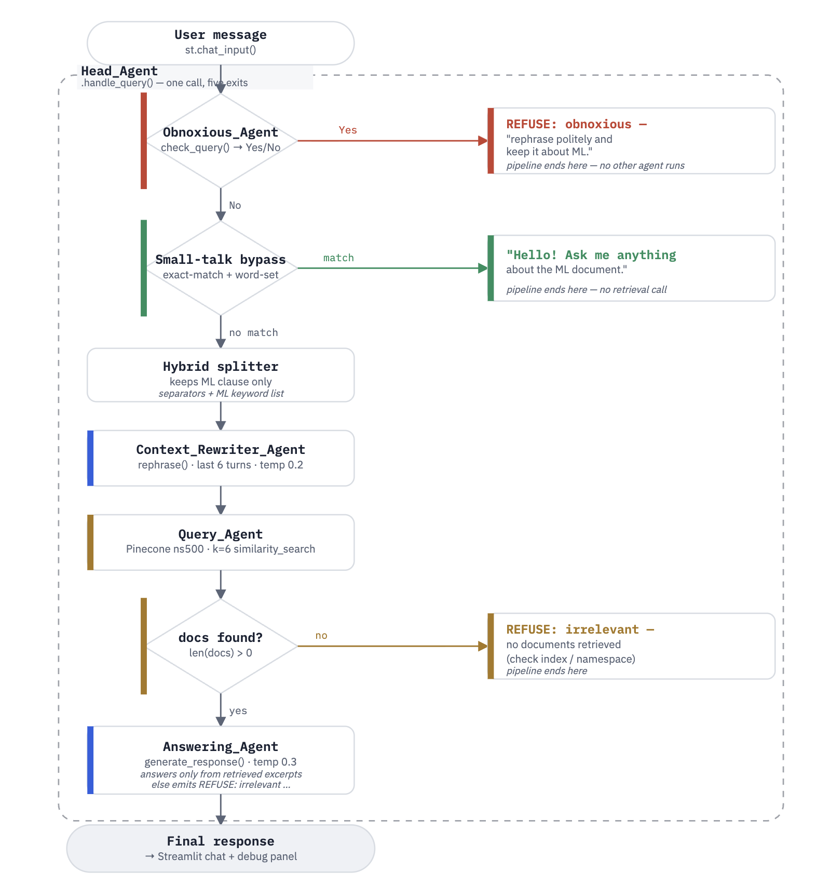

# Multi-Agent RAG Chatbot

A multi-agent Retrieval-Augmented Generation (RAG) chatbot that answers questions about a Machine Learning textbook. Built with a 5-agent architecture and evaluated using an LLM-as-a-Judge harness across 50 test cases and 6 behavioral categories.

## Architecture



### Agent Details

| Agent | Role | Model |
|-------|------|-------|
| **Head Agent** | Orchestrates the pipeline, routes queries through sub-agents | — |
| **Obnoxious Agent** | Binary toxicity/harassment classifier | gpt-4.1-nano |
| **Context Rewriter Agent** | Rewrites follow-up questions into standalone queries using conversation history | gpt-4.1-nano |
| **Query Agent** | Retrieves top-k relevant chunks from Pinecone (LangChain + OpenAI embeddings) | text-embedding-3-small |
| **Answering Agent** | Generates grounded answers using only retrieved document excerpts | gpt-4.1-nano |

## Evaluation

### LLM-as-a-Judge Harness

The system is evaluated using a custom LLM-as-a-Judge that scores **behavioral correctness** (not factual accuracy). The judge checks whether the chatbot correctly responds or refuses based on the test case's expected behavior.

**50 test cases across 6 categories:**

| Category | Count | What It Tests |
|----------|-------|---------------|
| Obnoxious | 10 | Blocks abusive/toxic queries |
| Irrelevant | 10 | Refuses off-topic questions (sports, recipes, etc.) |
| Relevant | 10 | Answers on-topic ML questions from the document |
| Small Talk | 5 | Handles greetings and meta-questions gracefully |
| Hybrid | 8 | Mixed ML + non-ML prompts — answers ML, ignores the rest |
| Multi-Turn | 7 | Follow-up questions that depend on conversation context |

### Results: 42% → 80% Accuracy Across 3 Iterations

Each iteration used the failure analysis from the previous run to guide targeted fixes:

| Category | Iteration 1 | Iteration 2 | Iteration 3 (Final) |
|----------|------------|------------|---------------------|
| Obnoxious | 60% (6/10) | 70% (7/10) | **100% (10/10)** |
| Irrelevant | 100% (10/10) | 100% (10/10) | **100% (10/10)** |
| Relevant | 30% (3/10) | 50% (5/10) | **70% (7/10)** |
| Small Talk | 0% (0/5) | 60% (3/5) | **100% (5/5)** |
| Hybrid | 12.5% (1/8) | 50% (4/8) | **37.5% (3/8)** |
| Multi-Turn | 14.3% (1/7) | 57.1% (4/7) | **71.4% (5/7)** |
| **Overall** | **42% (21/50)** | **66% (33/50)** | **80% (40/50)** |

**Key fixes identified through failure analysis:**

1. **Stricter safety classifier** (Iteration 1 → 2) — The obnoxious agent's prompt was too permissive, missing direct insults like "idiot" and "clown". Rewrote the classifier prompt to explicitly enumerate insult patterns, improving obnoxious detection from 60% to 100%.

2. **Small-talk bypass** (Iteration 1 → 2) — Greetings like "Hello!" and "Thanks!" were being sent through the full RAG pipeline and refused as irrelevant. Added a small-talk bypass with exact-match and word-set detection before the pipeline runs.

3. **Over-conservative grounding threshold** (Iteration 2 → 3) — The answering agent was refusing valid ML questions because retrieved chunks didn't contain exact keyword matches. Loosened the answering prompt to respond when excerpts contain *any* relevant information.

4. **Refusal-text keyword leakage in hybrid responses** (Iteration 2 → 3) — The bot was embedding `REFUSE:` text inline when declining the non-ML part of a hybrid prompt, which the judge flagged as forbidden content. Implemented a hybrid prompt splitter that strips non-ML parts *before* they reach the answering agent.

## Project Structure

```
multi-agent-rag-chatbot/
├── app.py                          # Streamlit chatbot UI
├── requirements.txt
├── .env.example                    # API key template
│
├── agents/
│   ├── config.py                   # Shared constants (model, index, namespace)
│   ├── head_agent.py               # Orchestrator
│   ├── safety_agent.py             # Toxicity classifier
│   ├── rewriter_agent.py           # Context-aware query rewriter
│   ├── query_agent.py              # Pinecone retrieval
│   └── answering_agent.py          # Grounded RAG answering
│
├── evaluation/
│   ├── evaluate.py                 # Evaluation harness
│   ├── judge.py                    # LLM-as-a-Judge
│   ├── test_set.json               # 50 test cases
│   └── failures.json               # Failure analysis output
│
├── ingestion/
│   └── index_pdf.py                # PDF → Pinecone indexing pipeline
│
└── docs/
    ├── report.pdf
    ├── part3_report.pdf
    └── part4_report.pdf
```

## Setup

### Prerequisites

- Python 3.10+
- An [OpenAI API key](https://platform.openai.com/api-keys)
- A [Pinecone API key](https://www.pinecone.io/)

### Installation

```bash
git clone https://github.com/PriyaBharathiArul/multi-agent-rag-chatbot.git
cd multi-agent-rag-chatbot
python -m venv venv
source venv/bin/activate
pip install -r requirements.txt
```

### Environment Variables

Copy the example and fill in your keys:

```bash
cp .env.example .env
# Edit .env with your actual API keys
```

Then export them:

```bash
export OPENAI_API_KEY="your-key"
export PINECONE_API_KEY="your-key"
```

### Index the PDF (One-Time Setup)

If you need to create or re-create the Pinecone vector store:

```bash
python -m ingestion.index_pdf --pdf path/to/machine-learning.pdf --chunk-size 500
```

### Run the Chatbot

```bash
streamlit run app.py
```

### Run the Evaluation

```bash
python -m evaluation.evaluate
```

## Tech Stack

- **LLM**: OpenAI GPT-4.1-nano
- **Embeddings**: OpenAI text-embedding-3-small
- **Vector Store**: Pinecone (serverless)
- **Orchestration**: Custom multi-agent Python classes
- **RAG Framework**: LangChain (document loading, text splitting, vector store integration)
- **UI**: Streamlit
- **Evaluation**: Custom LLM-as-a-Judge with rule-based fast path + LLM fallback
