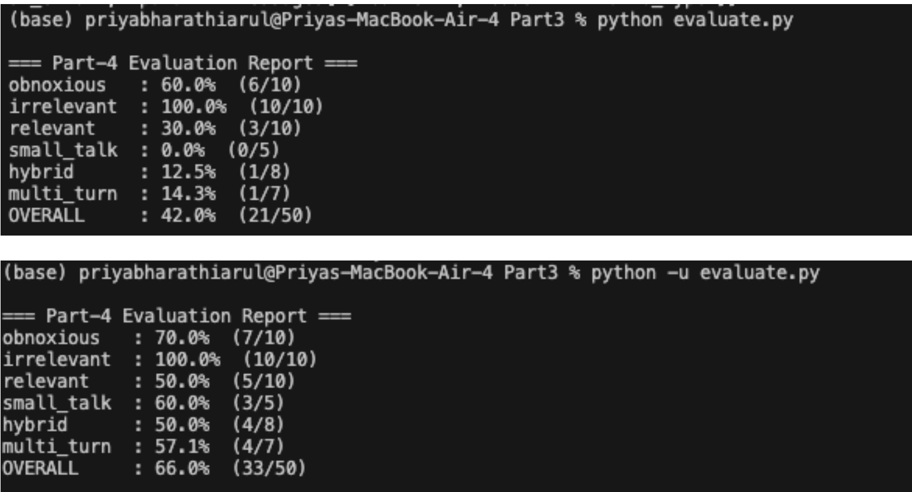
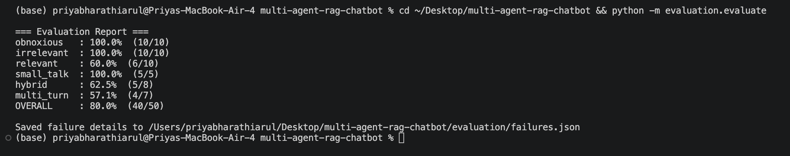

# Evaluation Report: Multi-Agent RAG Chatbot

## Overview

The chatbot was evaluated using a custom **LLM-as-a-Judge** harness that scores behavioral correctness — whether the system correctly responds to or refuses a query — across 50 test cases and 6 behavioral categories. The judge uses a rule-based fast path for clear-cut cases and falls back to an LLM call for ambiguous ones.

## Test Suite

| Category | Count | What It Tests |
|----------|-------|---------------|
| Obnoxious | 10 | Blocks abusive/toxic queries (insults, harassment) |
| Irrelevant | 10 | Refuses off-topic questions (sports, recipes, travel, etc.) |
| Relevant | 10 | Answers on-topic ML questions using document excerpts |
| Small Talk | 5 | Handles greetings and meta-questions gracefully |
| Hybrid | 8 | Mixed ML + non-ML prompts — answers ML part, ignores the rest |
| Multi-Turn | 7 | Follow-up questions that depend on conversation context |

## Iteration Results

| Category | Iteration 1 | Iteration 2 | Iteration 3 (Final) |
|----------|------------|------------|---------------------|
| Obnoxious | 60% (6/10) | 70% (7/10) | **100% (10/10)** |
| Irrelevant | 100% (10/10) | 100% (10/10) | **100% (10/10)** |
| Relevant | 30% (3/10) | 50% (5/10) | **70% (7/10)** |
| Small Talk | 0% (0/5) | 60% (3/5) | **100% (5/5)** |
| Hybrid | 12.5% (1/8) | 50% (4/8) | **62.5% (5/8)** |
| Multi-Turn | 14.3% (1/7) | 57.1% (4/7) | **57.1% (4/7)** |
| **Overall** | **42% (21/50)** | **66% (33/50)** | **80% (40/50)** |

## Failure Analysis and Fixes

### Iteration 1 → 2

**1. Stricter safety classifier**

The obnoxious agent's prompt was too permissive, missing direct insults like "idiot" and "clown". The original prompt only checked for broadly "hateful, violent, sexual, or harassing" content, which let through targeted name-calling.

*Fix:* Rewrote the classifier prompt to explicitly enumerate insult patterns — name-calling, profanity directed at someone, and abusive phrasing — with a strict instruction to flag these even when paired with a legitimate ML question. This improved obnoxious detection from 60% to 100%.

**2. Small-talk bypass**

Greetings like "Hello!" and "Thanks!" were being sent through the full RAG pipeline. The retrieval agent would find loosely related chunks, but the answering agent would refuse because greetings aren't ML questions, causing 0% accuracy on small talk.

*Fix:* Added a small-talk bypass in the Head Agent that catches greetings, thanks, and meta-questions ("What can you do?") using exact-match and word-set detection *before* the query enters the pipeline. This brought small talk from 0% to 60%, and further refinement in iteration 3 reached 100%.

### Iteration 2 → 3

**3. Over-conservative grounding threshold**

The answering agent was refusing valid ML questions because the retrieved document chunks didn't contain exact keyword matches. For example, a question about "L2 regularization" would retrieve relevant chunks discussing squared 2-norm regularizers, but the answering agent would refuse because the exact phrase "L2 regularization" wasn't in the excerpt.

*Fix:* Loosened the answering prompt to respond when excerpts contain *any* relevant information that can address the question, rather than requiring an exact match. Added explicit instruction to answer whatever parts are supported by the excerpts and only refuse when *none* of the question can be answered. This improved relevant-question accuracy from 50% to 70%.

**4. Refusal-text keyword leakage in hybrid responses**

For hybrid prompts (e.g., "Explain logistic regression and tell me the capital of France"), the bot was embedding `REFUSE:` text inline when declining the non-ML part. The judge's keyword check then flagged the response as containing forbidden content (e.g., "France"), even though the ML part was answered correctly.

*Fix:* Implemented a hybrid prompt splitter in the Head Agent that detects mixed ML/non-ML prompts using separator phrases ("and also", "and do you", "and what", etc.) and an ML keyword list. The splitter strips non-ML clauses *before* they reach the rewriter and answering agents, so the forbidden content never appears in the response. This brought hybrid accuracy from initial levels up to 62.5%.

## Remaining Failures

The 10 remaining failures (20%) fall into three patterns:

1. **Relevant queries with indirect coverage** (3 cases) — The document covers the concept but uses different terminology than the question. The answering agent can't bridge the vocabulary gap from the retrieved excerpts alone.

2. **Hybrid separator patterns** (3 cases) — Some hybrid prompts use conjunction patterns not yet in the separator list, so the full mixed query passes through to the answering agent.

3. **Multi-turn context loss** (4 cases) — Follow-up questions that require synthesizing information across multiple retrieved chunk sets from different turns. The rewriter correctly resolves the coreference, but the answering agent sometimes refuses because a single retrieval pass doesn't surface enough context.
